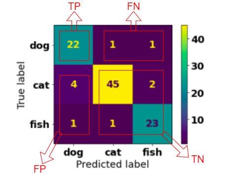

# Mid-Semester Test
### Wenxiao Zhang (22792191)


<br>


### **Question 1**

1. Create the workspace, load necessary librarys, and load the data content of both datasets.
2. Inspect the  data structures and attributes of both datasets, check if missing value exists. If missing or invalid value exists, perform data cleaning for both data sets.
3. Visualize the data to look for correlations of the attributes.
4. Perform feature scaling for feature attributes of both data sets to normalize the range of the data.
5. Extract feature matrix (X_train, X_test) and class label (y_train, y_test) from both datasets.
6. instantiate Support Vector Machine classifier model and fit it using training sets.
    ```py
    svc = SVC()
    svc.fit(X_train, y_train)
    ```
7. select some hyperparameters and use grid search to find out the model which has the highest accuracy score.
   ```py
   param_grid = [{'C': [1, 10, 100, 1000],  'kernel' : ['rbf', 'linear', 'poly']}]
   grid_search = GridSearchCV(svc, param_grid, scoring='accuracy', cv=3)
   grid_search.fit(X_train, y_train)
   ```
8.  use the model obtained from step 7 to perform prediction.
    ```py
    y_pred = grid_search.best_estimator_.predict(X_test)
    ```
9.  use confusion matrix and accuracy score to evaluate the performance of the model.
    ```py
    confusion_matrix(y_true=y_test, y_pred=y_pred)
    accuracy_score(y_test, y_pred)
    ```

### **Question 2**

**(i)**

For an n x n confusion matrix, 
 - The total number of test examples of a class is the sum of the corresponding row,which is also `TP+FN` for that class.
 - The total number of `FN` for a class is the sum of values in the corresponding row excluding the `TP`.
 - The total number of `FP` for a class is the sum of values in the corresponding column excluding the `TP`.
 - The total number of `TN` for a class is the sum of all columns and rows excluding that class's column and row.

The figure below is an example of the distribution of `TP, FN, FP, TN` in the confusion matrix for the `dog` class.
<center></center>

After understanding this, we can use the given formulas to caculate the precision and the recall for each class based on the values displayed in the confusion matrix. Then we can caculate the average precision and average recall by summing them up and then divided them by n. 

For example, for the 3-class classification problem in this question. The average precision will be `AP = (P_dog + P_cat + P_fish)/3`, and the average recall will be `AR = (R_dog + R_cat + R_fish)/3`.

**(ii)**
```py
import numpy as np

cm = [[22, 1, 1], [4, 45, 2], [1, 1, 23]]

precisions = []
recalls = []

for i in range(3):
    precisions.append(cm[i][i]/sum(row[i] for row in cm))
    recalls.append(cm[i][i]/np.sum(cm[i]))

# average precision accurate up 2 decimal place
average_precision = round(np.sum(precisions)/3, 2)
# average recall accurate up 2 decimal place
average_recall = round(np.sum(recalls)/3, 2)

print('average precision: ' f'{average_precision}')
print('average recall: ' f'{average_recall}')
```
The output results of the code above are:

`average precision: 0.89`

`average recall: 0.91`

### **Question 3**

**1. data cleaning:**

 - load the data content from the csv file by applying `pandas.read_csv()` method. Specify `skiprows=1` to skip the first row because the column names in the file are located in the second row. Using regex `' */*'` in the `sep=` parameter of `read_csv` can remove extra whitespaces in the value of `Classes`. 
```py
import pandas as pd

data = pd.read_csv("modified-Algerian_forest_fires_dataset.csv", skiprows=1, sep=' *, *', engine='python')
```
 - use `unique()` to check if `Classes` has 2 distinct values:
```py
data["Classes"].unique()
```
 - use `info()` to check if the dataset has missing values:
```py
data.info()
```

**2. data preparation:**

To make the data fit to the classification model and ensure its performance, apply feature scaling for feature variables in the dataset.
```py
from sklearn.preprocessing import StandardScaler

# standardize the feature data
scaler = StandardScaler()
features = data.drop('Classes', axis=1).columns
data[features] = scaler.fit_transform(data[features])
```

**3.  feature selection:**

A good first choice method for binary classification problems is using Logistic Regression. Initialy Making all feature variables fit to the model to select the important feature variables. Computing the coefficients and drop those redundant features whose coefficient values equating to 0. The remaining features would be suitable to use for the classification task.
```py
from sklearn.linear_model import LogisticRegression

# split features and class label into X and y
X = data.drop('Classes', axis=1)
y = data['Classes']

# fit the model
lr = LogisticRegression(penalty='l1', solver='liblinear')
lr.fit(X, y)

# find and extract important features
coefs = lr.coef_[0]
important_features = X.columns[list(coefs!=0)].tolist()
X = X[important_features]
```

**4. Extracting training set and testing set:**

Using `train_test_split` method to perform training and testing data extraction. Set `test_size=0.3` so that the model can have enough training data to fit.
```py
import numpy as np
from sklearn.model_selection import train_test_split

X_train, X_test, y_train, y_test = train_test_split(X, y, test_size=0.3, random_state=42)
```

### **Question 4**

**(i)** 

***a) binary classification***


weather classification

 - 1 class label, 2 distinct values in the class label: rainy, not rainy. This indicate if the weather is rainy or not.
 - 5 features related to rainy: date, temperature, air pressure, wind, humidity. These are possible features related to rainy.

***b) multiclass classification***

 fruit classification

 - 1 class label, multiple values in the class label (5 in this case): apple, pear, orange, watermelon, grape.
 - 5 features related to fruit: color, weight, flavor, texture, firmness. These are possible features to predict a fruit in the class label.

***c) multilabel classification***

animal classification

 -  multiple class labels (2 in this case): is_aquatic, is_mammalian, 
 -  2 distinct values for each class label: 
    -  is_aquatic: aquatic, not aquatic; 
    -  is_mammalian: mammalian, not mammalian.
 -  4 features: weight, height, lifespan, intelligence. These are possible features to predict the value of each label.


***d) multioutput multiclass classification***

video classification

 - multiple class labels (3 in this case): video_type, video_category, video_rating
 - multiple values in the class label (3 in this case): 
   - video_type: TV show, moive, news
   - video_category: romantic, comedy, horror
   - video_rating: G, PG, M
 - 4 features: video_length, audience_job, audience_age, audience_num. These are possible features to predict the value of each label.

**(ii)**

line 1-4: load essential modules.

line 6-8: instantiate SDGClassifier by specifying values to seven parameters of the classifier and assigning to `sgd`.

line 10-12: initialize 3 variables for evaluating the model.
 - `max_val_accuracy`: the highest accuracy score achieved by the model.
 - `best_epoch`: the epoch in which the model achieved the highest accuracy score.
 - `best_sgd`: the cloned model achieved the highest accuracy score.

line 14-21: This part of the code tries to find the optimal state of the model and clone it in order to perform prediction on testing set.
 - The model perform prediction and accuracy evaluation for 100 times in the `for loop`. 
 - Using a `if` statement in each iteration to check if the current accuracy of the model is higher than `max_val_accuracy`. If the statement is true, reassign the values obtained in this iteration to those variables. 

line 23-27:  This part is to use the best model obtained from previous steps to predict the test set and evaluate its performance.
- print `best_epoch` in which the model achieved the highest accuracy. 
- use `best_sgd` to predict the test set. `best_sgd` is the cloned model obtained from the `best_epoch` iteration.
- Evaluate the prediction of the test set by applying `accuracy_score` and `confusion_matrix`. Using `y_test`, `y_pred` as the input parameters and printing the result.

### **Question 5**

**(i)**

The hyperparameter α controls how much you want to regularize the model. 

For Ridge Regression, if α = 0 then Ridge is Linear Regression. If α is very large, then all weights end up very close to 0 and the result is a flat line going through the data's mean. The α in Lasso Regression acts similar with that in Ridge Regression. 

The mix ratio *r* can be controlled. When *r*=0, Elastic Net is equivalent to Ridge Regression, and when *r*=1, it is equaivalent to Lasso Regression.

**(ii)**

For Polynomial kernel, if an underfitting issue occurs, we can try increasing the polynomial degree *d* because it cannot deal with very complex datasets at a low *d*. For example, when *d* is 1, it becomes a linear model. If the input data has a complex distribution, a linear model will very likely underfitting. Increase *d* appropriately can help the model to fit the data.

For Gaussian RBF kernel, *γ* acts like a regularization hyperparameter: if the model is underfitting, *γ* should be increased because increasing *γ* makes each instance's range of influence become smaller, which will make the decision boundary more closer around individual instances, which means the model will fit the data better.

**(iii)**

We should use `fit_transform()` for training set and then use `transform()`
 for testing set.
Both `StandardScaler` and `MinMaxScaler` are used for feature scaling. In this case, we need to apply a transformer to the dataset and then perform transform on the feature values.

 - `fit()` method fits the calculation on the feature values of input data to the transformer.
 - `transform()` method have to be used in front of a fit object because we need to transform the fit calculations
 - `fit_transform()` method is the combination of `fit()` method and `transform()` method. This method performs fit and transform on the input data at a time. It is equivalent to `fit().transform()`. 

For training set, we need both fit and transform steps. If we use `fit()` and `transform()` separately, it will decrease the efficiency of the model so we choose to use `fit_transform()` which will do both of the work.

For testing set, as we already fitted the training data to the model, what we need to do here is to transform the dataset using `transform()`.

